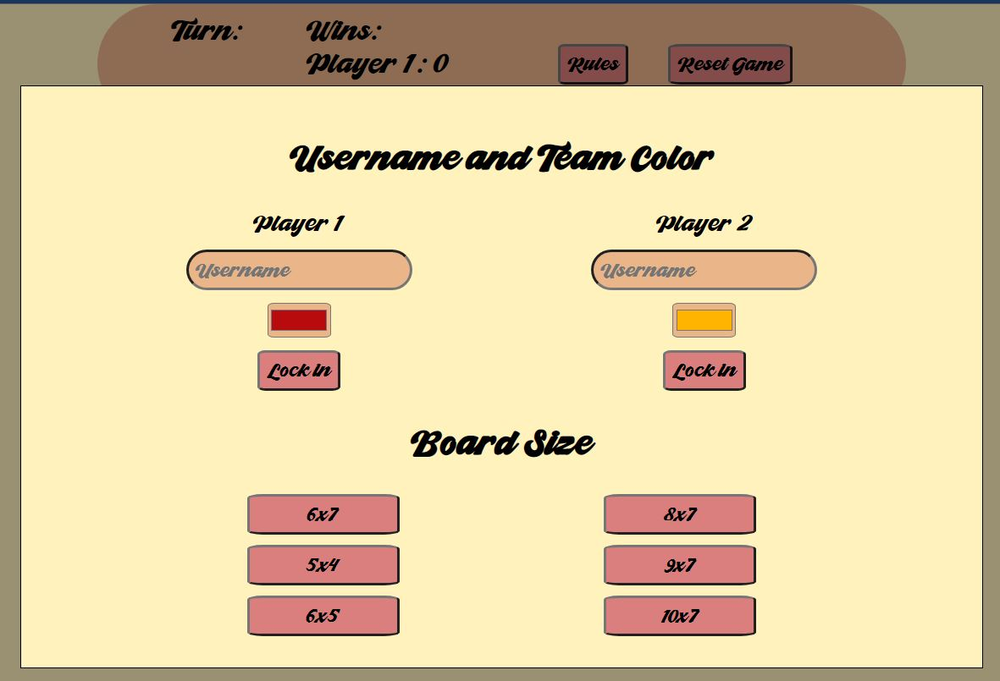
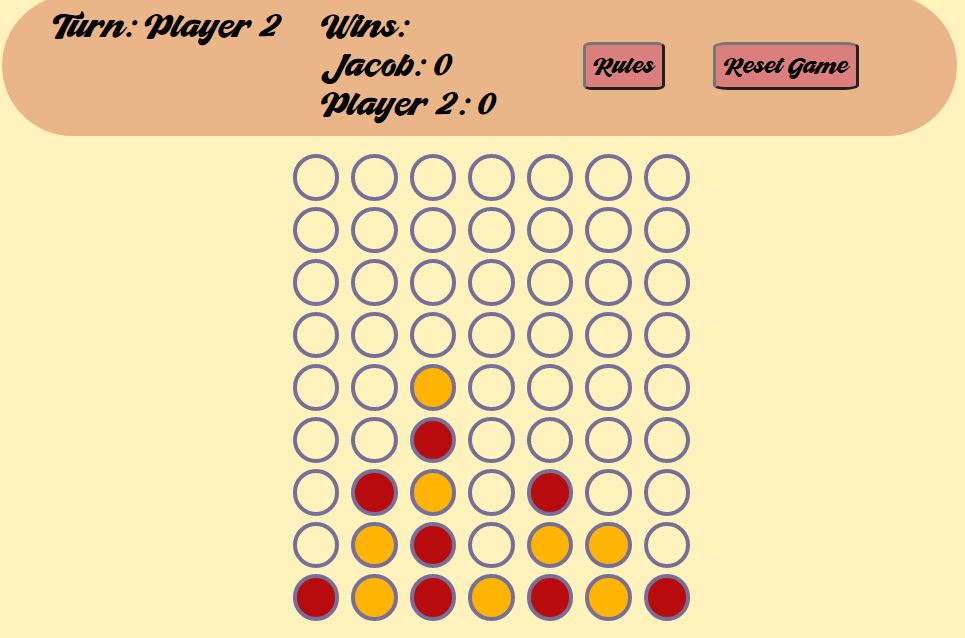

# Connect Four

## Live Link

[Play here!](https://jacver.github.io/connect-four/)

## Project Description

This project is a browser version of the popular game. Built using only vanilla javascript, HTML5, and CSS it's an exercise in DOM manipulation and moving through arrays and loops.

## Features

- Dynamic grid (gameboard) sizing based on user choice
- Usernames and team colors based on user input (or defaults if no input)
- Nested loops and conditionals to determine win logic
- 2-D array mirroring the visible gameboard

## Challenges

- The win logic (particularly diagonal) was a bit tricky. Particularly when accounting for out-of-bounds checks.

## Roadmap

- Including a color palette swapper
- Eliminating the need for users to "lock in" customization options on landing page. Ideally, these inputs will submit automatically or when closed/focus exited.

## Production Stage

## Wireframe

